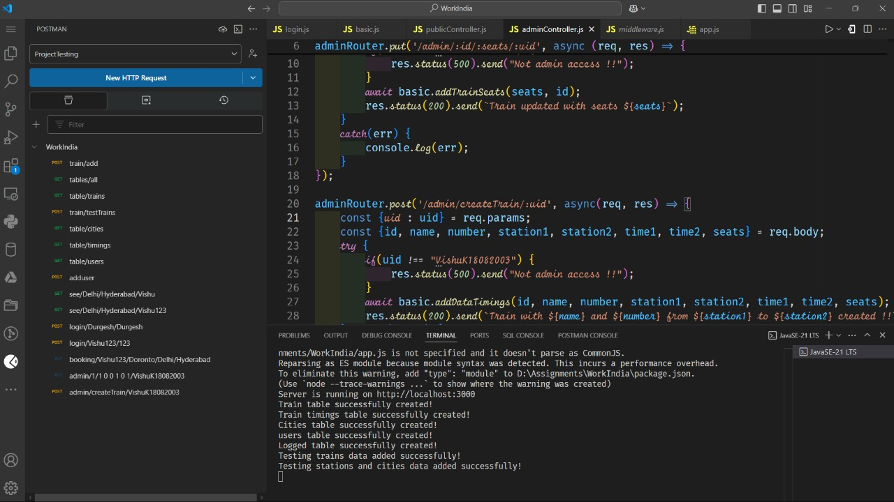

## ${\color{lightblue} IRCTC \space Booking \space Platform}$

This repository is for the assignment provided by WorkIndia. The project encapsulates all the points mentioned in the assignment with the best solution possible from my end. There are few pacakages that need to be installed before running the code.

    npm install express nodemon mysql mysql2

Also, make sure to have MySQL installed in the localhost. It may not be necessary to have a database named 'irctc' created in MySQL.

After installing these packages, run the below command to start the api

    node app.js

---

### ${\color{lightblue} Folder \space Structure}$

After the API starts, there are many endpoints and routes created, the folder structure is explained below

    ---- api                            contains API endpoints
     |    |--- basic.js                  basic endpoints (get, add, etc.)
     |    |--- login.js                  login endpoints (login user, add user, etc.)
     |    |--- middleware.js             middlewares
     |    |--- tables.js                 tables schema using SQL
     |
     |-- controller                      routes or controllers
     |    |--- adminController.js        admin controllers (add train, update seats)
     |    |--- basicController.js        basic controllers (see train, status of train)
     |    |--- publicController.js       public controllers (login, book train, main code logic...)
     |    |--- testController.js         few basic data will be automatically added via these api when the server starts
     |
     |-- data                            data related work
     |    |--- authToken.js              authorisation token
     |    |--- data.js                   test data to be added in mysql
     |
     |-- node modules                    localhost modules
     |-- app.js                          application file
     |-- databaseConnection.js           MYSQL connection file
     |-- package-lock.json               dependencies (not to be altered)
     |-- package.json                    dev dependencies

Now the folder are structured to exploit the concept of microservices, such that all the api's are first defined with their MySQL queries in the `api` folder and then they are called one or more times in the `controller` foler to perform the specified operations. Also, these controllers are linked together inside the `app.js` such that all the routing and Data handling takes place from the root file `app.js`.

---

### ${\color{lightblue} Schemas}$

I have created five tables in MYSQL to store the data and interact with the APIs and routes.

| S. No. | Schema | Purpose |
|-|-|-|
| 1. | trains | store abstract train data (quick retrieval) |
| 2. | cities | storing city details |
| 3. | timings | trains detailed data (for booking api) |
| 4. | users | user data (signed up) |
| 5. | logged | details of currently active users |

---

### ${\color{lightblue} Tests}$

These are the test api's that are used and are working perfectly fine, in the codebase. All the above-mentioned api's are correct and accurate and they need to be tested in a chronological order, then only they will provide the desired output.

Like for checking the Train status, first you need to add yourself as a user - via `/adduser` api, then only you can access the `see/Delhi/Hyderabad` api. Likewise are for other cases as well.

- train/add -> to add trains
- table/all -> to show all tables
- table/train -> to show train table (or any other)
- train/testTrain -> test train data creation api
- table/cities -> to show cities table
- table/timings -> to show train complete details table
- table/users -> to show the users as signed up
- see/Delhi/Hyderabad -> to see the trains between station1 and station2
- login/Vishu... -> for user login
- booking/... -> for a logged in user to book ticket
- admin/1 0 ... -> admin to update the seats status of a train
- admin/createTrain -> admin creating a new train

---

### ${\color{lightblue} Train \space Booking \space Logic}$

I am providing a brief overview of my approach here. Firstly, only the logged in users - via `login` api can book train. The api will allow them to be logged in for ***5 minutes***. Then a ${\color{lightblue}map}$ is created which stores the key as the unique train number of every train, and a ${\color{lightblue}queue}$ for every train (the queue stores the information of the users who came to book the train in chronological order by time). When a person is booking a train via `booking` api that train will be lockec for 1 minute duration for other people, but they can book other trains. This will the server to handle requests asynchronously and thus book tickets for multiple users at once. Since, fetching data from map and head of the queue (both Data Structures which are being used in the methodology), have `O(1)` time, it is one the most optimal approach to simultaneously book the tickets and to maintian atomicity via generating an `authToken` after the booking is successful.

---

##### I hereby affirm and guarantee that the entire codebase is written solely by me without the use of any AI tools and this project reflects a small portion of my abilites and skills.

#### ${\color{lightblue} Vishu\space Kalier}$

